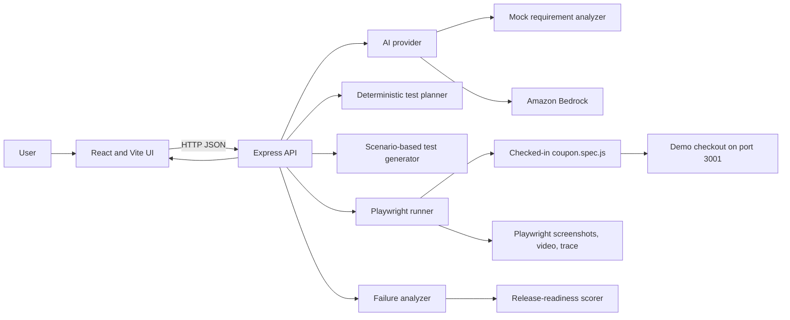

# ReleaseGuard AI

ReleaseGuard AI is a release-testing prototype that turns a natural-language software requirement into a structured QA analysis and test plan, displays generated Playwright test code, runs a browser test, explains failures, and summarizes a basic release-readiness score.

The repository demonstrates how AI-assisted requirement analysis can sit alongside deterministic test planning, browser automation, and evidence-based failure reporting. It currently uses a coupon-checkout demo to make that workflow concrete. It is a prototype, not a general-purpose test platform yet: important limitations are listed below and should be part of any technical explanation of the project.

## Contents

- [What It Does](#what-it-does)
- [Architecture](#architecture)
- [Technology](#technology)
- [Repository Layout](#repository-layout)
- [Run It Locally](#run-it-locally)
- [Configuration](#configuration)
- [End-to-End Workflow](#end-to-end-workflow)
- [API Reference](#api-reference)
- [Testing and Evidence](#testing-and-evidence)
- [Deployment](#deployment)
- [Current Limitations](#current-limitations)
- [Interview Preparation](#interview-preparation)
- [Next Engineering Steps](#next-engineering-steps)

## What It Does

The application presents a requirement-analysis workflow:

1. A user enters a software requirement in the React interface.
2. The backend returns a feature summary, expected behavior, test scenarios, and risks. The requirement analyzer is configurable to use a local mock or Amazon Bedrock.
3. The backend turns the analysis scenarios into a small test plan and classifies each scenario as positive, negative, or edge-case using keyword rules.
4. The backend generates Playwright test source code for a few known coupon scenarios and returns it to the UI for display.
5. The user can request browser test execution. The backend launches the checked-in coupon test, gathers Playwright output and failure artifact paths, and returns a pass/fail result.
6. A failure is converted into a structured diagnosis and a simple readiness score, then shown in the UI with available screenshot, video, and trace links.

The included checkout intentionally accepts `SAVE20` without calculating the discount. That defect gives the browser test a repeatable failure to analyze: the expected discount is ₹200 and the expected total is ₹800 from a ₹1000 item, while the demo leaves the discount at ₹0 and total at ₹1000.

## Architecture



### Component responsibilities

- **Frontend (`frontend/`)**: React page for entering a requirement, viewing analysis and risks, creating a test plan, displaying generated source, requesting test execution, and viewing results. Vite serves the development build.
- **API (`backend/server.js`)**: Express routes validate request fields and coordinate analysis, planning, generation, execution, and result formatting. CORS is enabled for all origins and JSON request bodies are parsed with Express.
- **AI provider (`backend/ai/provider.js`)**: Selects the requirement analyzer using `AI_PROVIDER`. The default is the deterministic mock. With `AI_PROVIDER=bedrock`, requirement analysis calls the Bedrock implementation.
- **Bedrock adapter (`backend/bedrock.js`)**: Calls Amazon Bedrock Runtime Converse with the configured model and parses the response as JSON.
- **Test planner (`backend/ai/test-planner.js`)**: Maps scenario strings into numbered plan entries and labels them using simple keyword matching.
- **Test generator (`backend/ai/test-generator.js`)**: Produces test source for recognized coupon scenarios and a basic title-check fallback for other descriptions.
- **Test runner (`backend/test-runner/runner.js`)**: Runs `npx playwright test tests/coupon.spec.js` from the repository root, interprets the process exit code, extracts selected assertion values and artifact paths from output, and returns them to the API.
- **Demo checkout (`demo-app/`)**: A static Express server on port 3001 hosting a deliberately defective coupon page.
- **Failure and readiness logic (`backend/ai/`)**: Turns a failed run into a fixed, structured coupon-oriented explanation, and applies a small severity-based score adjustment.

### Request/data flow

The frontend makes JSON `POST` requests to the API. Analysis and test-plan data are held in frontend component state and passed between API calls. There is no database, durable job queue, user account, or saved project history. The backend executes the browser test synchronously within the `/api/run-tests` request.

## Technology

- **Frontend**: React 19, JavaScript, Vite 8, Tailwind CSS 4 packages/configuration
- **Backend**: Node.js, Express 5, CommonJS JavaScript
- **Browser automation**: Playwright Test
- **Optional requirement-analysis model**: Amazon Bedrock Runtime, Converse API, `global.amazon.nova-2-lite-v1:0` in `ap-south-1`
- **Hosting/configuration represented in the repository**: AWS Amplify build configuration for the static frontend and a Playwright-based Docker image for backend/test execution

## Repository Layout

```text
.
├── README.md                    # Project guide
├── package.json                 # Root dependencies, including Playwright Test
├── playwright.config.js         # Browser test settings and reporters
├── amplify.yml                  # Amplify frontend build configuration
├── start.sh                     # Starts demo checkout and backend on shell systems
├── backend/
│   ├── server.js                # Express API and route coordination
│   ├── bedrock.js               # Bedrock Converse integration
│   ├── Dockerfile               # Container image for backend plus Playwright
│   ├── ai/
│   │   ├── provider.js          # Mock/Bedrock provider selection
│   │   ├── mock-ai.js           # Fixed mock requirement analysis
│   │   ├── test-planner.js      # Scenario classification
│   │   ├── test-generator.js    # Playwright source generation
│   │   ├── failure-analyzer.js  # Structured failure explanation
│   │   └── release-analyzer.js  # Readiness score calculation
│   └── test-runner/runner.js    # Playwright process and evidence extraction
├── demo-app/
│   ├── server.js                # Static demo server on port 3001
│   └── public/index.html        # Deliberately failing coupon scenario
├── frontend/
│   └── src/                     # React application and styles
├── tests/coupon.spec.js         # Checked-in browser test
├── test-results/                # Playwright failure artifacts
└── playwright-report/           # HTML test report output
```

## Run It Locally

### Prerequisites

- Node.js 20.19+ or 22.12+ and npm (Node 22 LTS is a suitable choice for the current Vite toolchain).
- A browser supported by the installed Playwright version. In a local setup, install Chromium with the command below if it is not already installed.
- AWS credentials and Bedrock model access only if using the Bedrock requirement analyzer. The mock provider needs no cloud credentials.

### Install dependencies

Run from the repository root:

```sh
npm install
cd backend
npm install
cd ../frontend
npm install
cd ..
npx playwright install chromium
```

Playwright is declared in the root package. The backend has its own dependencies, including the AWS SDK used by the optional Bedrock integration; the frontend has a separate package manifest.

### Start the application

Start each process in a separate terminal from the repository root (PowerShell commands shown):

```powershell
# Terminal 1: coupon demo, http://localhost:3001
node demo-app/server.js
```

```powershell
# Terminal 2: API, http://localhost:5000
Set-Location backend
npm start
```

```powershell
# Terminal 3: frontend, usually http://localhost:5173
Set-Location frontend
npm run dev
```

On macOS/Linux, the same commands work in a POSIX shell. The root `start.sh` starts the demo and backend together, but it does not start the Vite frontend. It is a shell script and is not directly executable as a native PowerShell script.

**Frontend API endpoint note:** the current React source uses a fixed deployed API URL rather than a configurable local API base URL. Consequently, a local Vite page sends workflow requests to that hosted API even if a local backend is running. For a fully local end-to-end run, change the API base URL in `frontend/src/App.jsx` to `http://localhost:5000` (or make it configurable as a follow-up improvement). The Playwright test itself uses `http://localhost:3001` from `playwright.config.js`.

### Check the services

With the backend running, open `http://localhost:5000/api/health`. A healthy backend returns:

```json
{
  "success": true,
  "message": "ReleaseGuard AI backend is running"
}
```

Open `http://localhost:3001` to inspect the demo checkout. The Vite terminal prints the frontend URL when its server starts.

## Configuration

The backend loads `.env` through `dotenv`. Create `backend/.env` for local backend settings; do not commit credentials.

| Variable | Purpose | Default / behavior |
| --- | --- | --- |
| `AI_PROVIDER` | Requirement analysis provider | `mock`; set to `bedrock` to call Amazon Bedrock |
| AWS credentials | Authenticate Bedrock requests | Uses the AWS SDK default credential chain; provide credentials through your normal local or AWS runtime method |
| `AWS_REGION` | AWS SDK region override | The current Bedrock client explicitly sets `ap-south-1`, so this variable does not currently override it |
| `TEST_APP_URL` | URL referenced by some generated scenarios | The checked-in Playwright test instead uses the fixed `baseURL` in `playwright.config.js`; the generated code is not currently executed by the runner |

The frontend's deployed backend base URL is hardcoded in `frontend/src/App.jsx`, as are the base URLs used to display evidence files. The backend listens on port 5000 and the demo checkout on port 3001; both are currently constants in source code.

## End-to-End Workflow

### Requirement analysis

`POST /api/analyze` sends the submitted requirement to `analyze()` in `backend/ai/provider.js`. With the default mock provider, `backend/ai/mock-ai.js` returns fixed coupon-discount content; it does not interpret the submitted text. With `AI_PROVIDER=bedrock`, `backend/bedrock.js` sends a prompt requesting JSON fields for feature, summary, expected behavior, scenarios, and risks, then parses the model text with `JSON.parse`.

### Test plan and generated source

`POST /api/create-test-plan` maps the analysis scenarios into numbered entries and infers type from keywords: terms such as `invalid`, `expired`, `reject`, and `fail` indicate negative cases; `valid`, `success`, and `apply` indicate positive cases; other scenarios are marked edge cases.

`POST /api/generate-tests` turns those entries into JavaScript source strings. The generator has specific branches for the valid 20% coupon, invalid coupon, and expired coupon. Other scenarios receive a generic page-title assertion. The generated source is returned to and displayed by the frontend.

### Browser execution and failure reporting

`POST /api/run-tests` currently runs the repository's checked-in `tests/coupon.spec.js`, regardless of the generated source shown in the interface. Playwright is configured to use `http://localhost:3001`, take screenshots on failure, and retain traces and videos on failure. The runner extracts artifact paths and assertion values from CLI output. The backend serves the `test-results/` directory at `/test-results`.

If execution fails, `backend/ai/failure-analyzer.js` currently returns a fixed coupon-discount diagnosis, augmented with the extracted expected/actual values and evidence paths. `backend/ai/release-analyzer.js` starts from 100 and subtracts 35/20/10 for HIGH/MEDIUM/LOW severity. A passing run is `READY` with score 100; a HIGH failure scores 65 and is `READY WITH RISKS`. This is a demonstration heuristic, not a calibrated release-risk model.

## API Reference

All routes are served by the Express API at port 5000 and use JSON request/response bodies.

| Method and route | Request body | Successful response |
| --- | --- | --- |
| `GET /api/health` | None | `{ "success": true, "message": "..." }` |
| `POST /api/analyze` | `{ "requirement": "..." }` | `{ "success": true, "analysis": { "feature", "summary", "expectedBehavior", "scenarios", "risks" } }` |
| `POST /api/create-test-plan` | `{ "analysis": { ... } }` | `{ "success": true, "plan": { "feature", "scenarios": [{ "id", "description", "type" }] } }` |
| `POST /api/generate-tests` | `{ "plan": { ... } }` | `{ "success": true, "tests": "...Playwright source..." }` |
| `POST /api/analyze-failure` | `{ "failure": { ... } }` | `{ "success": true, "analysis": { "severity", "category", "title", "expected", "actual", "likelyCause", "businessImpact", "recommendation", "evidence" } }` |
| `POST /api/run-tests` | None | `{ "success": true, "passed", "failure", "failureAnalysis", "releaseReadiness", "output" }` |

Missing required fields return HTTP 400. Unhandled processing errors return HTTP 500. Test failures are generally returned as a successful API response with `success: true` and `passed: false`; `success` indicates that the test-run request was processed, while `passed` reports the test outcome.

## Testing and Evidence

Run the checked-in test from the repository root:

```sh
npx playwright test tests/coupon.spec.js
```

The current demo intentionally does not apply the discount, so the test is expected to fail at the discount assertion. That failure is the intended walkthrough for screenshots, retained video/trace artifacts, failure explanation, and release-risk output. The HTML report is configured to write to `playwright-report/`.

The root and backend `npm test` scripts are placeholders that exit with “no test specified”; use the Playwright command above. The frontend has `npm run lint` and `npm run build` scripts, and the backend has `npm start` and `npm run dev` scripts (`nodemon`).

## Deployment

- **Frontend build**: `amplify.yml` runs `npm ci` and `npm run build` from `frontend/`, then publishes `frontend/dist`. It expects a lockfile usable by `npm ci` in that directory.
- **Backend/test container**: `backend/Dockerfile` uses the Playwright 1.63.0 Noble image, installs root and backend dependencies, copies the repository, and starts the demo checkout and API. It exposes ports 5000 and 3001.
- **Cloud integrations**: the frontend currently points to a deployed ECS API URL in its source. Bedrock calls require AWS credentials and permission to invoke the configured model in `ap-south-1`.

The repository contains build/container configuration, but not a complete infrastructure-as-code definition for provisioning all AWS resources. Confirm the deployed service, permissions, networking, and frontend endpoint separately when reproducing a deployment.

## Current Limitations

- The mock requirement analyzer always returns coupon scenarios, regardless of user input.
- The test plan is keyword-driven rather than semantically validated.
- Generated tests are only displayed; the run endpoint always executes `tests/coupon.spec.js`.
- The generator supports a few coupon phrases and falls back to a weak page-title assertion for other scenarios.
- Failure analysis is a fixed coupon-specific template. Bedrock is wired only for requirement analysis; failure analysis remains mock logic even when `AI_PROVIDER=bedrock`.
- The demo checkout is intentionally defective and is not a real application under test.
- The frontend API and evidence URLs are hardcoded, complicating local development and deployment to another environment.
- API test execution is synchronous and has no job queue, timeout policy, concurrency management, or per-run isolation.
- There is no persistence, authentication, authorization, request rate limiting, or user/project separation. CORS currently allows every origin.
- Readiness scoring is a simple severity penalty and should not be treated as a production release decision.
- Root and backend npm test scripts are placeholders; automated coverage is currently centered on the single Playwright demo test.

## Interview Preparation

### Short project pitch

“ReleaseGuard AI is a prototype for AI-assisted release validation. It accepts a natural-language requirement, returns a structured QA analysis, creates a scenario-based test plan, displays generated Playwright code, executes a browser test against a demo checkout, and turns the resulting evidence into a failure explanation and a simple readiness score. The prototype combines a replaceable AI provider with deterministic planning and Playwright execution. Today, the execution path is intentionally narrow: it runs one checked-in coupon test, so generated tests are not yet connected to the runner.”

### Common questions and answers

**What problem does the project address?**

It explores reducing the gap between product requirements and executable QA checks. The intended flow makes expected behavior and risk explicit before a release and pairs failures with browser evidence and a business-oriented explanation.

**What happens when a user submits a requirement?**

The React app posts it to `/api/analyze`. The Express route calls the provider abstraction. The selected analyzer returns structured analysis, which React renders. The user can then request a plan and generated source through separate API calls.

**Why have a provider abstraction?**

It keeps the API independent of the analysis implementation. A mock implementation gives a deterministic, credential-free demo, while a Bedrock implementation can be selected without changing the route contract. In this version, only requirement analysis uses Bedrock; failure analysis is still mock logic.

**What does the mock provider do?**

It returns a fixed coupon-discount analysis. It is useful for demonstrating the workflow without a model, but it does not analyze arbitrary requirement text and should not be described as production AI.

**How are test scenarios generated?**

The selected analysis supplies scenario strings. The test planner numbers them and classifies their type with keyword matching. The test generator maps several coupon descriptions to Playwright code and uses a generic title assertion for unrecognized descriptions.

**Does the app run the test code it generates?**

Not yet. The UI displays generated code, but `/api/run-tests` launches the checked-in `tests/coupon.spec.js`. Connecting generated code to isolated, validated execution is a key next step.

**Why is the demo test expected to fail?**

The demo deliberately accepts `SAVE20` but leaves discount and total unchanged. The test expects a ₹200 discount and ₹800 total, so it shows how Playwright failure evidence can feed the analyzer and readiness summary.

**How does Playwright capture evidence?**

The project config enables screenshots on failure and retains traces and videos on failure. The runner parses the Playwright command output for assertion values and artifact paths; the backend exposes test-results files through a static route, and the UI builds links to those files.

**How is release readiness calculated?**

A pass returns READY and 100. For a failure, the current scorer subtracts a fixed number of points based on severity. A HIGH failure becomes 65 and is labeled READY WITH RISKS. This is a transparent demo heuristic, not a statistical or business-calibrated risk model.

**What is the backend's role?**

Express validates inputs, dispatches analysis, creates plans and source, runs Playwright, analyzes failures, calculates readiness, and returns structured JSON. It is also responsible for serving generated test artifacts.

**What does Bedrock add?**

It provides model-driven requirement analysis using the Converse API and an instruction prompt that requests JSON for feature, expected behavior, scenarios, and risks. The current code uses Amazon Nova 2 Lite in `ap-south-1`. Credentials come from the AWS SDK's normal credential chain.

**How would you improve reliability of model output?**

Validate responses against a schema, handle malformed or fenced JSON, add retry and timeout policies, record provider errors without exposing secrets, and test the adapter with representative outputs. In the current implementation, the response is parsed directly with `JSON.parse`.

**How would you safely execute generated tests?**

Validate and constrain the generated test format, run each execution in a disposable isolated worker/container with resource limits and a timeout, restrict network access and filesystem access, and associate each run with its own artifacts. Avoid evaluating arbitrary model-generated code in the long-lived API process.

**Why not run Playwright directly inside the HTTP request?**

It is simple for a small demo, but long runs consume request and server resources and make retries/concurrency harder. A production design would enqueue a run, execute it in an isolated worker, persist run state and artifacts, and let the client poll or subscribe for results.

**How does the frontend communicate with the API?**

It uses `fetch` with JSON requests. Currently, the deployed API origin is hardcoded in `App.jsx`; environment-based configuration should replace it so local, preview, and production builds can use different endpoints.

**What are the main security concerns?**

The API currently has open CORS and no authentication, authorization, rate limiting, or run isolation. Generated code execution would also be a high-risk boundary. Production use would require authentication, strict origin policy, input limits, isolated execution, secret management, and careful artifact access controls.

**How would you test the system?**

Unit-test provider selection, plan classification, test generation, failure mapping, and readiness scoring; integration-test Express routes with mocked dependencies; and keep browser tests for the demo workflow. Add tests for malformed input, provider failures, timeout behavior, and artifact serving. The existing test currently serves as a deliberate failing demo rather than a passing regression suite.

**What would you build next?**

First, make API and demo URLs configurable. Then connect validated generated tests to an isolated Playwright worker and add run IDs/timeouts. Next, replace fixed mock analysis and failure interpretation with validated provider outputs, add automated unit/API tests, and make readiness scoring reflect multiple test outcomes and explicit policy thresholds.

### Honest scope statement

In an interview, describe the code that exists separately from the intended product direction. In particular, say that requirement-to-test generation is demonstrated, but arbitrary generated test execution, generalized app-under-test support, production-grade risk scoring, and production security controls are not implemented yet.

## Next Engineering Steps

1. Move backend, demo, and evidence URLs into environment-based configuration.
2. Add automated unit and API tests and replace the placeholder npm test scripts.
3. Validate model and API data at boundaries with a schema.
4. Execute generated tests only in isolated workers, with run-level timeouts and artifact separation.
5. Make the application-under-test URL and test adapters explicit inputs instead of coupon-specific assumptions.
6. Add authentication, authorization, restrictive CORS, persistence, and auditable release policies before handling real projects.